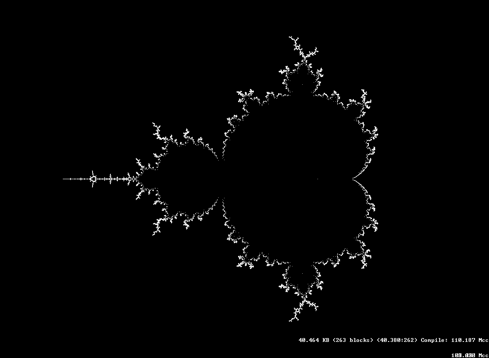
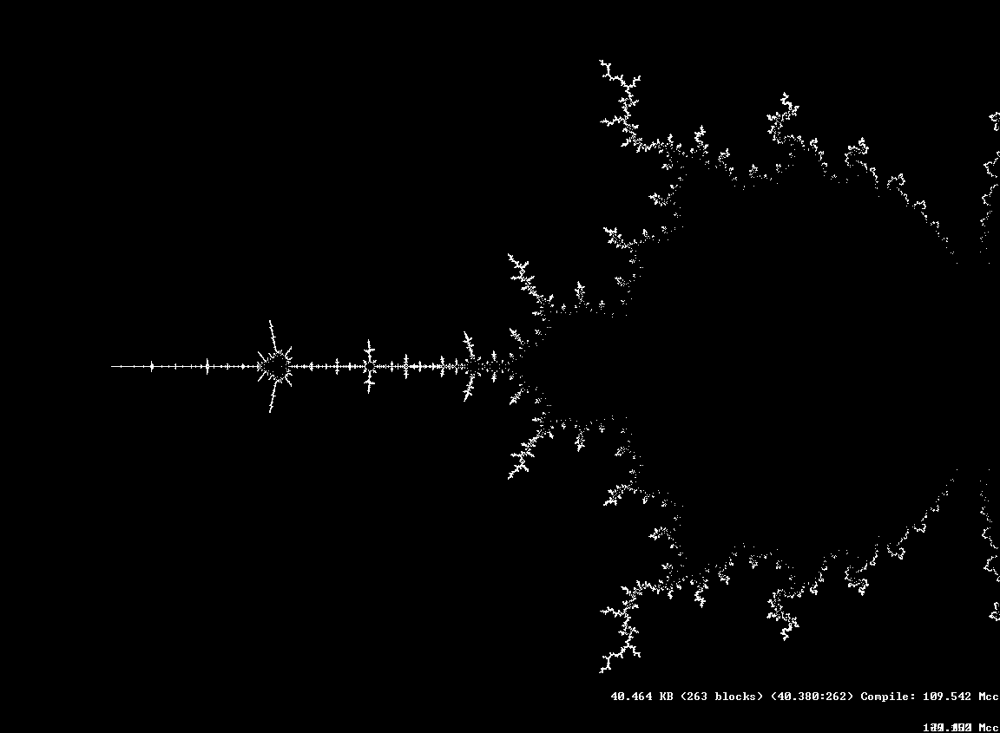
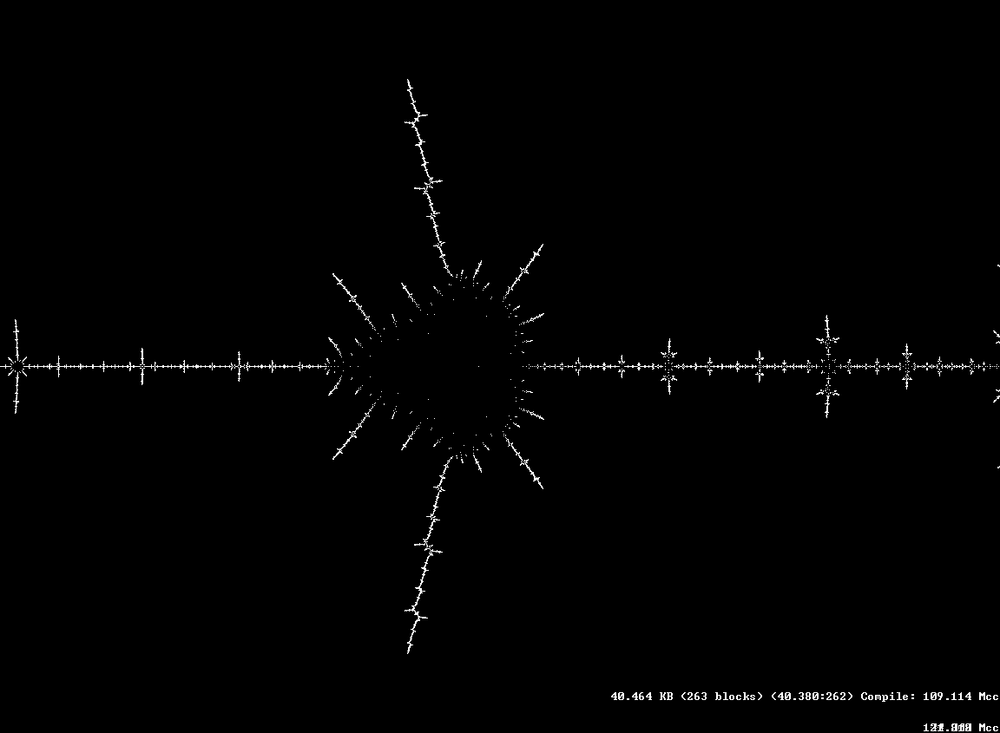

Compute roots of the Mandelbrot polynomial using interval arithmetics, subdivision and Newton-Raphson for root polishing. Done back in 2013. See [this thread](http://www.fractalforums.com/theory/the-mandelbrot-polynomial-roots-challenge/). A faster version written in c++ is available [here](http://www.fractalforums.com/theory/the-mandelbrot-polynomial-roots-challenge/msg89499/#msg89499).

**Pictures**

